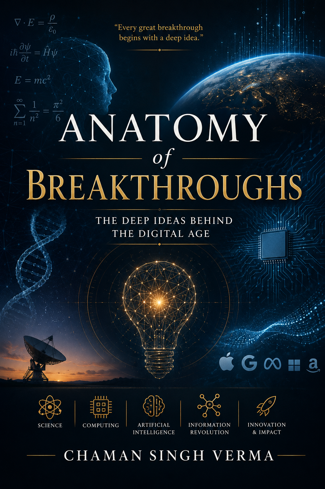

# Anatomy of Breakthroughs

[]()



A scholarly monograph examining the foundational ideas that shaped modern computer science, information theory, and computational complexity.

## Overview

Fourteen chapters explore breakthroughs spanning:

- **Computability** — Turing machines, λ-calculus, the Church--Turing Thesis
- **Undecidability** — The halting problem, Gödel's incompleteness theorems, Rice's Theorem
- **Information theory** — Shannon entropy, channel capacity, error-correcting codes
- **Algorithmic information** — Kolmogorov complexity, algorithmic randomness
- **Computational complexity** — P vs. NP, NP-completeness, the PCP theorem
- **Cryptography** — Public-key systems, zero-knowledge proofs, post-quantum schemes
- **Distributed computing** — Consensus protocols, the FLP impossibility theorem
- **Interactive proofs** — IP = PSPACE, multi-prover systems

Each chapter develops the relevant mathematics rigorously, situating results within their historical and conceptual context.

## Structure

| Part | Title | Chapters |
|------|-------|----------|
| I | The Nature of Computation | 1--4 |
| II | Information | 5--7 |
| III | Difficulty and Coordination | 8--13 |
| IV | Epilogue | 14 |

## Intended Audience

Graduate students and researchers in theoretical computer science, mathematics, and related fields.

### Prerequisites

- Discrete mathematics (sets, functions, relations, induction, combinatorics)
- Linear algebra (vector spaces, matrices, eigenvalues, determinants)
- Probability theory (random variables, expectation, variance, concentration inequalities)
- Basic programming (algorithmic correctness)

A self-contained review of mathematical prerequisites is provided in the appendix.

## Building the Book

```bash
make pdf        # Build the PDF
make clean      # Remove build artifacts
make check      # Verify compilation
```

## Citation

```bibtex
@book{deepideas2026,
  author = {Author Name},
  title = {Anatomy of Breakthroughs: The Deep Ideas Behind the Digital Age},
  year = {2026},
  note = {Unpublished monograph}
}
```

## License

All rights reserved.
